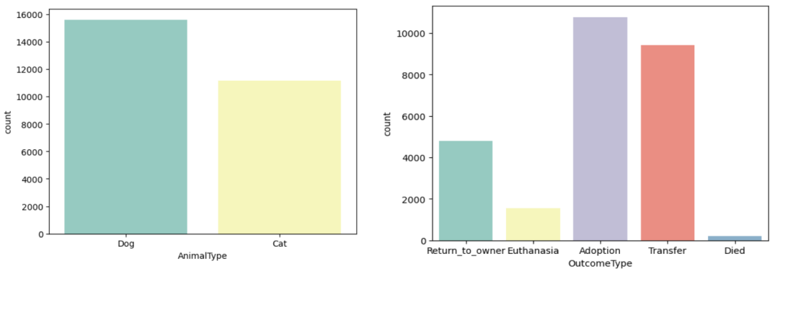
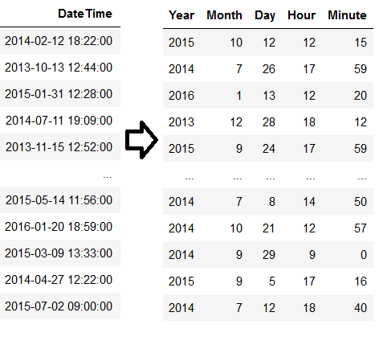
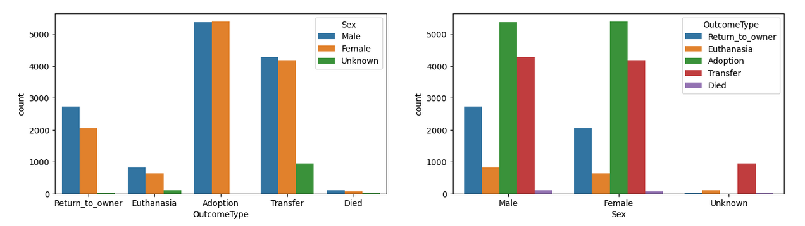
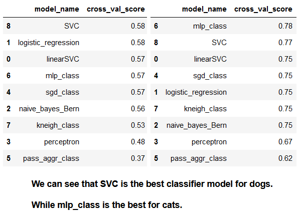

# Shelter Animals Outcome Prediction 🐶

🐕🐈 A step-by-step guide for predict outcomes of shelter animals. 🔍

    Author: Clément Cipriani
    Date: July, 2023
    Dataset: https://www.kaggle.com/competitions/shelter-animal-outcomes/data

👋 Introduction

In this project, our goal was to predict outcomes for cats and dogs in shelters, crucial for optimizing resources and enhancing animal welfare. We meticulously collected diverse data, including type, age, breed, color, health, and shelter duration. After thorough Exploratory Data Analysis (EDA) to identify pivotal factors, we preprocessed the data, split it into training and testing sets, and employed various machine learning models for classification, rigorously evaluating their performance. Hyperparameter tuning led to a highly accurate final model, now available to shelters for proactive intervention and improved resource allocation, fostering positive outcomes for shelter animals. 🏆

# Data Analysis

We will first take a look at the data and identify the animals in question.

# Data Cleaning / Preprocessing

We will then spend a considerable amount of time modifying the data to make it more suitable for the model. This involves adjusting existing features, creating new ones, and extracting data from the time column. These modifications will enable us to delve deeper into the Data Analysis.

# Model Creation / Prediction

Finally, we will split the dataset into the two types of animals: one for dogs, and one for cats. This will allow us to build two different models for each. To end this project, we will try to predict the outcomes of each type of animal.

